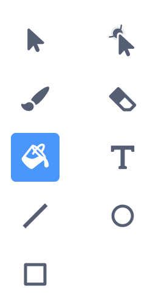

انقر فوق **ملء** وحدد اللون الذي تريده للنص الخاص بك:

{:width="150px"}

حدد أداة **نص**:

{:width="150px"}

انقر فوق محرر الرسام وابدأ في الكتابة.

Click on the **Font** drop-down menu and select the font that you want:

{:width="300px"}

If you want to resize your text, click on the **Select** (Arrow) tool and select the text, then drag the corner handles to resize the text:

{:width="300px"}

If you want to change the **Fill** colour of your text, use the **Fill** colour chooser to select a colour, then select the **Fill** (Bucket) tool and hold your mouse cursor over the text (or if you are using a tablet, tap the text). The text will automatically change colour. Click on the text to make the change:

{:width="150px"}

إذا كنت تريد أن تكون كل كلمة في رسالتك بلون وحجم وخط مختلف ، فاتبع العملية المذكورة أعلاه لكل كلمة في رسالتك.

Position your text and/or group of words with the crosshair in the centre of the Paint editor:

{:width="400px"}

To layer your words, use the **Forward** and **Backward** tools:

{:width="400px"}
