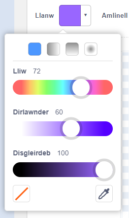
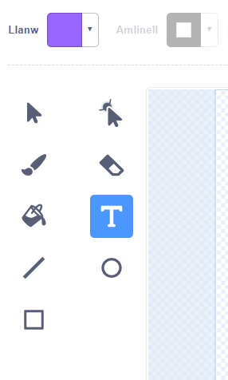
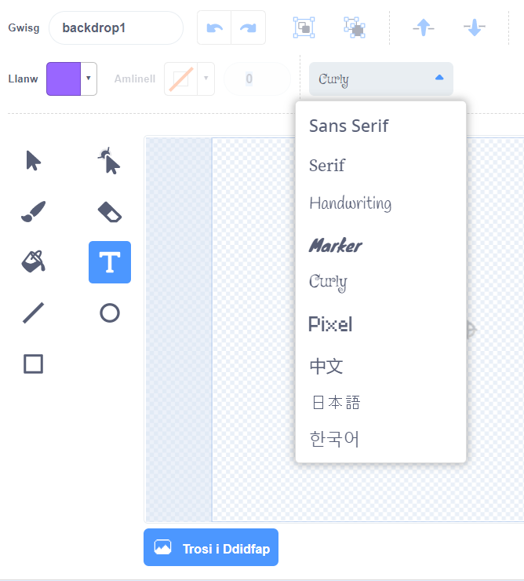
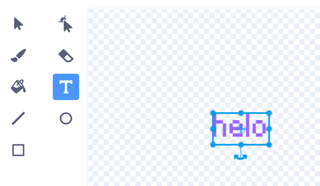
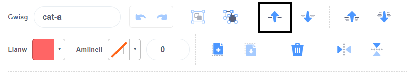

Cliciwch ar y detholydd lliwiau **Llenwi** a dewiswch y lliw rydych chi ei eisiau ar gyfer eich testun:

{:width="150px"}

Dewiswch yr offeryn **Testun**:

{:width="150px"}

Cliciwch ar y golygydd Paint a dechrau teipio.

Cliciwch ar y gwymplen **Ffont** a dewiswch y ffont rydych chi ei eisiau:

{:width="300px"}

Os ydych chi am newid maint eich testun, cliciwch ar yr offeryn **Dewiswch** (Saith) a dewiswch y testun, yna llusgwch y dolenni cornel i newid maint y testun:

{:width="300px"}

Os ydych am newid lliw **Llenwi** eich testun, defnyddiwch y detholydd lliw **Llenwil** i ddewis lliw, yna dewiswch yr offeryn **Llenwil** (Bwced) a daliwch gyrchwr eich llygoden dros y testun (neu os ydych yn defnyddio tabled, tapiwch y testun). Bydd y testun yn newid lliw yn awtomatig. Cliciwch ar y testun i wneud y newidiad:

{:width="150px"}

Os ydych chi am i bob gair yn eich neges fod yn lliw, maint a ffont gwahanol, yna dilynwch y broses uchod ar gyfer pob gair yn eich neges.

Gosodwch eich testun a/neu grŵp o eiriau gyda'r croeswallt yng nghanol y golygydd Paint:

{:width="400px"}

I haenu eich geiriau, defnyddiwch yr offeryn **Ymlaen** ac **Yn ôl**:

{:width="400px"}
