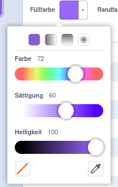
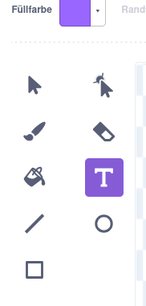
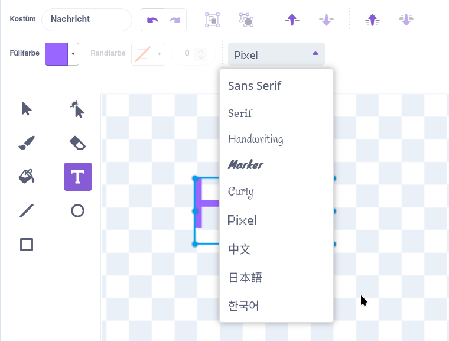
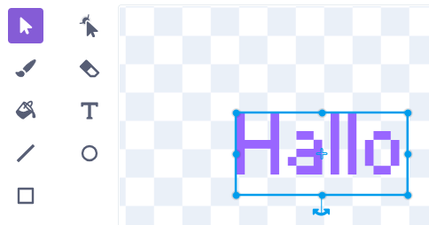
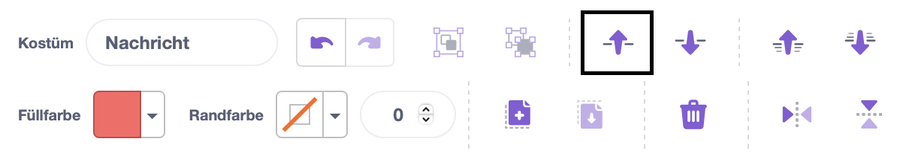

Klicke auf **Füllfarbe** und wähle die gewünschte Farbe für deinen Text aus:

{:width="150px"}

Wähle das **Text**-Werkzeug:

{:width="150px"}

Klicke auf den Zeicheneditor und beginne mit der Texteingabe.

Klicke auf das Dropdown-Menü **Schriftart** und wähle die gewünschte Schriftart aus:

{:width="300px"}

Wenn du die Größe deines Textes ändern möchtest, klicke auf das **Auswählen**-Werkzeug (Pfeil) und wähle den Text aus, dann ziehe die Eckpunkte, um die Textgröße zu ändern:

{:width="300px"}

Wenn du die **Füllfarbe** deines Textes ändern möchtest, nutze das Farbauswahlfeld **Füllfarbe**, um eine Farbe auszuwählen. Wähle dann das **Fülleimer**-Werkzeug (Eimer) und halte den Mauszeiger über den Text (Wenn du ein Tablet verwendest, tippe auf den Text). Der Text ändert automatisch seine Farbe. Klicke auf den Text, um die Änderung vorzunehmen:

{:width="150px"}

Wenn du möchtest, dass jedes Wort einer Nachricht eine andere Farbe, Größe und Schriftart hat, befolge die oben beschriebenen Schritte für jedes Wort in deiner Nachricht.

Positioniere deinen Text bzw. deine Wortgruppe mit dem Fadenkreuz in der Mitte des Zeicheneditors:

{:width="400px"}

Um die Reihenfolge zu ändern, in der deine Wörter sich überlagern, verwende die Werkzeuge **Nach Vorne** und **Nach Hinten**:

{:width="400px"}
