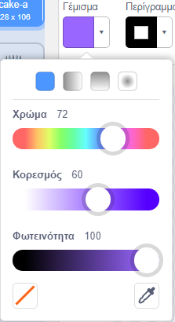
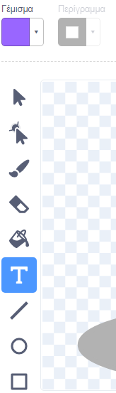
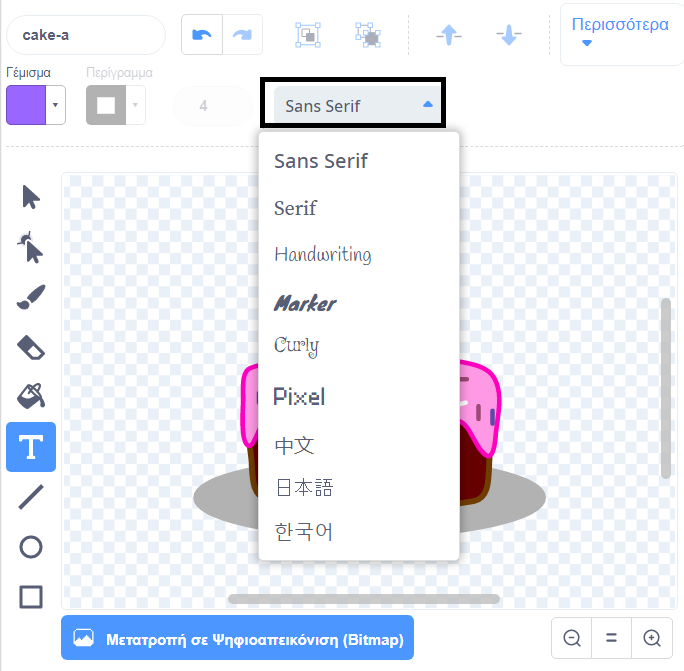
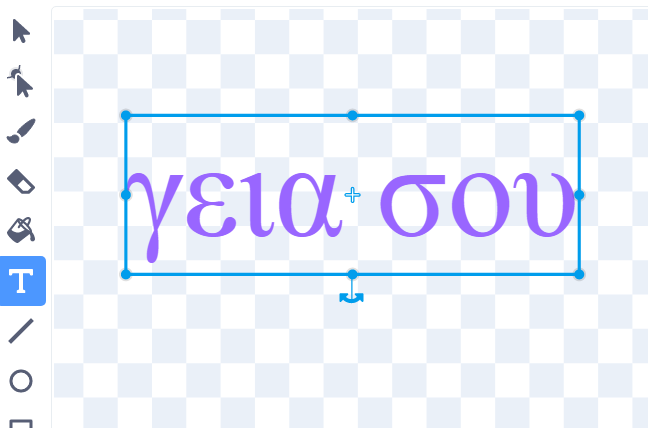
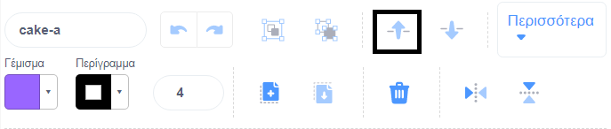

Κάνε κλικ στον επιλογέα **Γεμίσματος** χρώματος και επίλεξε το χρώμα που θέλεις για το κείμενό σου:

{:width="150px"}

Επίλεξε το εργαλείο **Κειμένου**:

{:width="150px"}

Κάνε κλικ στο πρόγραμμα επεξεργασίας εικόνας και ξεκίνησε να πληκτρολογείς.

Κάνε κλικ στο αναδυόμενο μενού **Γραμματοσειρά** και επίλεξε τη γραμματοσειρά που θέλεις:

{:width="300px"}

Εάν θέλεις να αλλάξεις το μέγεθος του κειμένου σου, κάνε κλικ στο εργαλείο **Επιλογή** (Βέλος) και επίλεξε το κείμενο και, στη συνέχεια, σύρε τις λαβές γωνιών για να αλλάξεις το μέγεθος του κειμένου:

{:width="300px"}

Εάν θέλεις να αλλάξεις το χρώμα **Γεμίσματος** του κειμένου σου, χρησιμοποίησε τον επιλογέα **Γεμίσματος** χρώματος για να επιλέξεις ένα χρώμα και, στη συνέχεια επίλεξε το **Γέμισμα** (Κουβάς) και κράτησε τον κέρσορα του ποντικιού πάνω από το κείμενο (ή εάν χρησιμοποιείς ένα tablet, πάτησε το κείμενο). Το κείμενο θα αλλάξει αυτόματα χρώμα. Κάνε κλικ στο κείμενο για να κάνεις την αλλαγή:

{:width="150px"}

Εάν θέλεις κάθε λέξη στο μήνυμα να έχει διαφορετικό χρώμα, μέγεθος και γραμματοσειρά, τότε ακολούθησε την παραπάνω διαδικασία για κάθε λέξη στο μήνυμά σου.

Τοποθέτησε το κείμενο ή/και την ομάδα λέξεων σου με το στόχαστρο στο κέντρο του επεξεργαστή εικόνας:

{:width="400px"}

Για να μεταφέρεις τις λέξεις σου σε διαφορετικά επίπεδα, χρησιμοποίησε τα εργαλεία **Προς τα Εμπρός** και **Προς τα Πίσω**:

{:width="400px"}

