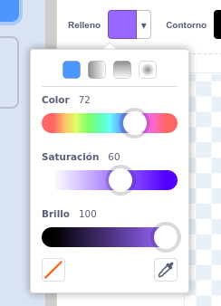
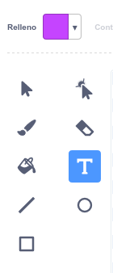
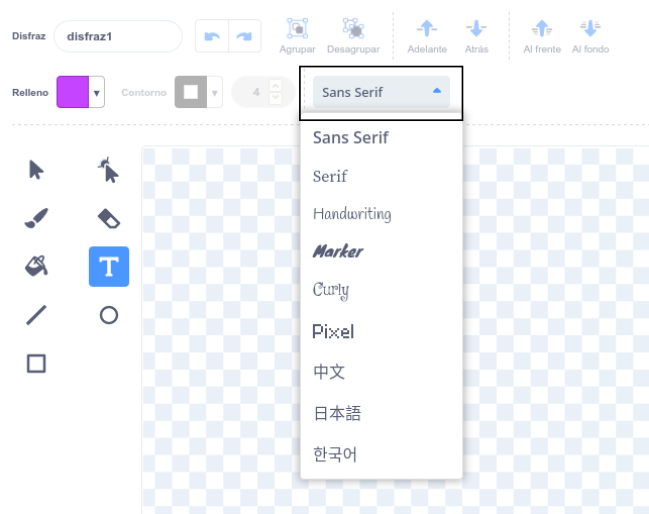
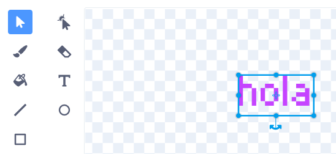
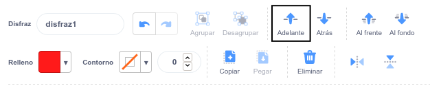

Haz clic en el selector de color **Rellenar** y selecciona el color que deseas para tu texto:

{:width="150px"}

Selecciona la herramienta **Texto**:

{:width="150px"}

Haz clic en el editor de Dibujo y comienza a escribir.

Haz clic en el menú desplegable **Fuente** y selecciona la fuente que desees:

{:width="300px"}

Si deseas ajustar el tamaño de tu texto, haz clic en la herramienta **Seleccionar** (flecha) y selecciona el texto, luego arrastra las manijas de las esquinas para ajustar el tamaño del texto:

{:width="300px"}

Si deseas cambiar el color de **Relleno** de su texto, usa el selector de color **Relleno** para seleccionar un color, luego selecciona la herramienta **Relleno** (Cubo) y mantén el puntero de tu ratón sobre el texto (o si estás usando una tableta, toca el texto). El texto cambiará de color automáticamente. Haz clic en el texto para realizar el cambio:

{:width="150px"}

Si deseas que cada palabra en un mensaje sea de un color, tamaño y fuente diferente, sigue el proceso anterior para cada palabra en tu mensaje.

Coloca tu texto y/o grupo de palabras con la mira en el centro del editor de Dibujo:

{:width="400px"}

Para tus palabras en capas, usa las herramientas **Adelante** y **Atrás**:

{:width="400px"}
