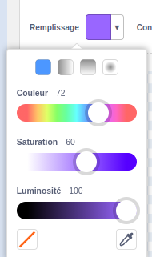
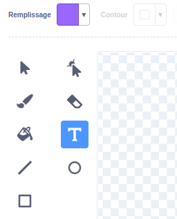
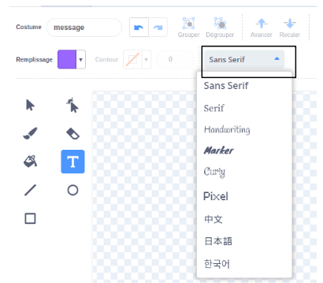
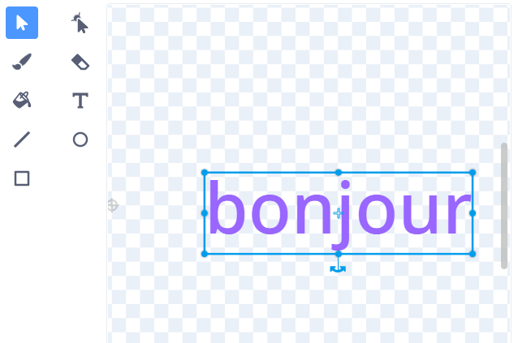
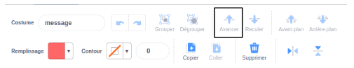

Clique sur le sélecteur de couleur **Remplissage** et sélectionne la première couleur que tu souhaites pour ton texte : {:width="150px"}

Sélectionne l'outil **Texte** : {:width="150px"}

Clique sur l'éditeur de peinture et commence à taper.

Clique sur le menu déroulant et sélectionne la police souhaitée : {:width="300px"}

Clique sur l'outil **Sélectionner (Flèche)** et sélectionne ton texte. Fais glisser les poignées pour redimensionner ton texte : {:width="300px"}

Tu veux changer la couleur de **Remplissage** ? Sélectionne l'outil **Remplissage (Sceau)** et passe la souris sur ton texte. Il changera automatiquement de couleur. Clique sur le texte pour effectuer la modification : {:width="150px"}

Si tu souhaites que chaque mot de ton message ait une couleur, une taille et une police différentes, suis la procédure ci-dessus pour chaque mot de ton message.

Positionne ton texte et/ou le groupe de mots avec le réticule au centre de l'éditeur de peinture : {:width="400px"}

Pour superposer tes mots, utilise les outils **Avancer** et **Reculer** : {:width="400px"}
