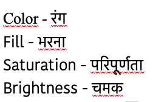
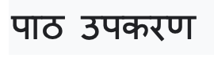
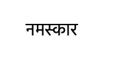
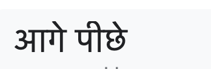

**भरें** रंग चयनकर्ता पर क्लिक करें और अपने पाठ के लिए इच्छित रंग का चयन करें:

{:width="150px"}

**टेक्स्ट** उपकरण चुनें:

{:width="150px"}

पेंट एडिटर पर क्लिक करें और टाइप करना शुरू करें।

**फ़ॉन्ट** ड्रॉप-डाउन विषय-सूची पर क्लिक करें और इच्छित फ़ॉन्ट चुनें:

{:width="300px"}

यदि आप अपने टेक्स्ट का आकार बदलना चाहते हैं, तो **सेलेक्ट** (मे) उपकरण पर क्लिक करें और टेक्स्ट का चयन करें, फिर टेक्स्ट का आकार बदलने के लिए कोने के हैंडल को खींचें:

{:width="300px"}

यदि आप अपने टेक्स्ट का **भरण** रंग बदलना चाहते हैं, तो रंग चुनने के लिए **भरण** रंग चयनकर्ता का उपयोग करें, फिर **भरण** (बाल्टी) टूल का चयन करें और टेक्स्ट पर अपना माउस कर्सर रखें (या यदि आप टैबलेट उपयोग कर रहे तो टेक्स्ट पर टैप करें)। टेक्स्ट का रंगअपने आप बदल जाएगा। परिवर्तन करने के लिए टेक्स्ट पर क्लिक करें:

{:width="150px"}

यदि आप चाहते हैं कि संदेश में प्रत्येक शब्द एक अलग रंग, आकार और फ़ॉन्ट हो, तो अपने संदेश में प्रत्येक शब्द के लिए उपरोक्त प्रक्रिया का पालन करें।

अपने पाठ और/या शब्दों के समूह को क्रॉसहेयर के साथ पेंट संपादक के केंद्र में रखें:

{:width="400px"}

अपने शब्दों को स्तरित करने के लिए, **आगे** और **पीछे** उपकरण का उपयोग करें:

{:width="400px"}
