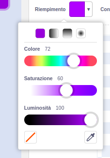
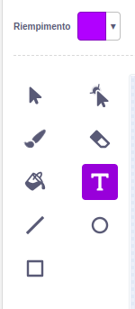
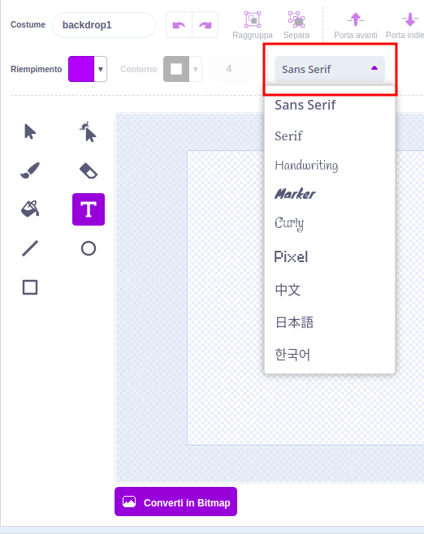
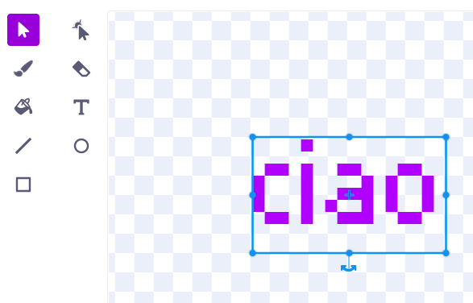
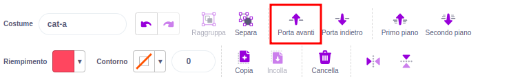

Clicca sul selettore di colori **Riempimento** e seleziona il colore che desideri per il tuo testo:

{:width="150px"}

Seleziona lo strumento **Testo**:

{:width="150px"}

Fai clic sull'editor di Paint e inizia a digitare.

Fai clic sul menu a tendina **Carattere** e seleziona il carattere desiderato:

{:width="300px"}

Se desideri ridimensionare il testo, clicca sullo strumento **Seleziona** (Freccia) e seleziona il testo, quindi trascina l'angolo per ridimensionare il testo:

{:width="300px"}

Se vuoi cambiare il colore di **Riempimento** del tuo testo, usa il selettore colore **Riempimento** per selezionare un colore, quindi seleziona lo strumento **Riempimento** (Secchiello) e tieni il cursore del mouse sopra il testo (o se stai usando un tablet, toccare il testo). Il testo cambierà automaticamente colore. Clicca sul testo per apportare la modifica:

{:width="150px"}

Se desideri che ogni parola in un messaggio abbia un colore, dimensione e carattere diversi, segui la procedura sopra per ogni parola nel messaggio.

Posiziona il testo e/o il gruppo di parole con il mirino al centro dell'editor di Paint:

{:width="400px"}

Per cambiare livello ai tuoi testi, usa gli strumenti **Porta avanti** e **Porta indietro**:

{:width="400px"}
