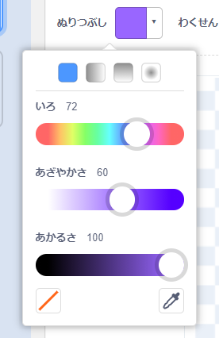
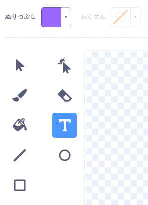
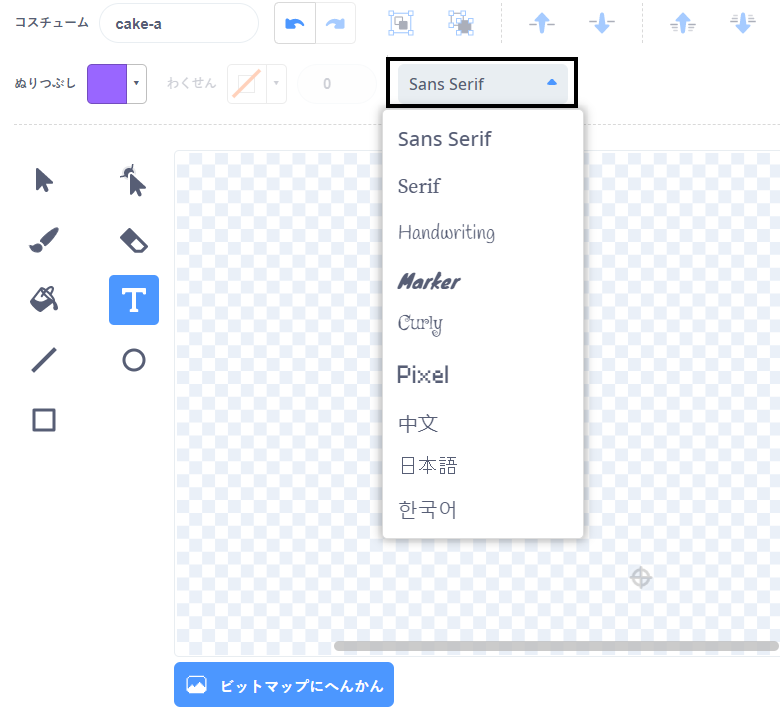
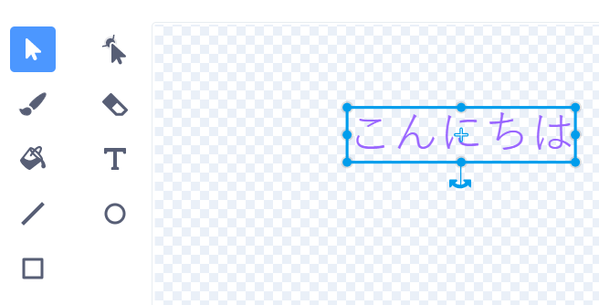
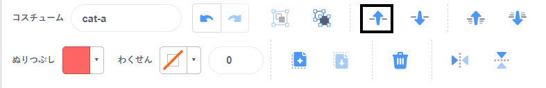

**塗りつぶし** をクリックして、テキストに使いたい色をえらびます: {:width="150px"}

**テキスト** ツールをえらびます: {:width="150px"}

ペイント画面をクリックして、テキストの入力を開始します。

ドロップダウンメニューをクリックして、使いたいフォントをえらびます: {:width="300px"}

**選択(矢印)** ツールでテキストをえらびます。 四角い枠の角にある小さいマークをドラッグしてテキストの大きさを変えます: {:width="300px"}

**塗りつぶし** の色を変えたい時は? **塗りつぶし(バケツ)** ツールをえらんで、マウスをテキストの場所まで移動します。 すると自動で色が変わります。 色を変えたいテキストのところで、クリックします: {:width="150px"}

一文字づつ色や大きさ、フォントを変えたい時は、一文字づつ同じステップをくりかえします。

テキストや文字グループをペイント画面の中央、十字線の場所に持っていきます: {:width="400px"}

**手前に出す** と **奥に下げる** を使って文字の重なりを調整します: {:width="400px"}
