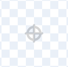

**Fill** ಕಲರ್ ಆಯ್ಕೆ ಮೇಲೆ ಕ್ಲಿಕ್ ಮಾಡಿ ಮತ್ತು ನಿಮ್ಮ ಪಠ್ಯಕ್ಕಾಗಿ ನಿಮಗೆ ಬೇಕಾದ ಬಣ್ಣವನ್ನು ಆಯ್ಕೆ ಮಾಡಿ:

{:width="150px"}

**Text** ಉಪಕರಣವನ್ನು ಆಯ್ಕೆ ಮಾಡಿ:

{:width="150px"}

ಪೇಂಟ್ ಎಡಿಟರ್ ಮೇಲೆ ಕ್ಲಿಕ್ ಮಾಡಿ ಮತ್ತು ಟೈಪ್ ಮಾಡಲು ಪ್ರಾರಂಭಿಸಿ.

**Font** ಡ್ರಾಪ್-ಡೌನ್ ಮೆನು ಮೇಲೆ ಕ್ಲಿಕ್ ಮಾಡಿ ಮತ್ತು ನಿಮಗೆ ಬೇಕಾದ ಫಾಂಟ್ ಅನ್ನು ಆಯ್ಕೆ ಮಾಡಿ:

{:width="300px"}

ನಿಮ್ಮ ಪಠ್ಯವನ್ನು ಮರುಗಾತ್ರಗೊಳಿಸಲು ನೀವು ಬಯಸಿದರೆ, **Select** (ಬಾಣ) ಉಪಕರಣದ ಮೇಲೆ ಕ್ಲಿಕ್ ಮಾಡಿ ಮತ್ತು ಪಠ್ಯವನ್ನು ಆಯ್ಕೆ ಮಾಡಿ, ನಂತರ ಪಠ್ಯದ ಮರುಗಾತ್ರಗೊಳಿಸಲು ಮೂಲೆಯ ಹ್ಯಾಂಡಲ್‌ಗಳನ್ನು ಎಳೆಯಿರಿ:

{:width="300px"}

ನಿಮ್ಮ ಪಠ್ಯದ **Fill** ಬಣ್ಣವನ್ನು ಬದಲಾಯಿಸಲು ನೀವು ಬಯಸಿದರೆ **Fill** ಕಲರ್ ಆಯ್ಕೆಯನ್ನು ಬಳಸಿ ಬಣ್ಣವನ್ನು ಆಯ್ಕೆ ಮಾಡಿ, ನಂತರ **Fill** (ಬಕೆಟ್) ಟೂಲ್ ಅನ್ನು ಆಯ್ಕೆ ಮಾಡಿ ಮತ್ತು ಪಠ್ಯದ ಮೇಲೆ ನಿಮ್ಮ ಮೌಸ್ ಕರ್ಸರ್ ಅನ್ನು ಹಿಡಿದುಕೊಳ್ಳಿ (ನೀವು ಟ್ಯಾಬ್ಲೆಟ್ ಬಳಸುತ್ತಿದ್ದರೆ, ಪಠ್ಯವನ್ನು ಟ್ಯಾಪ್ ಮಾಡಿ). ಪಠ್ಯವು ಸ್ವಯಂಚಾಲಿತವಾಗಿ ಬಣ್ಣವನ್ನು ಬದಲಾಯಿಸುತ್ತದೆ. ಪಠ್ಯದ ಬದಲಾವಣೆ ಮಾಡಲು ಪಠ್ಯದ ಮೇಲೆ ಕ್ಲಿಕ್ ಮಾಡಿ:

{:width="150px"}

ಸಂದೇಶದಲ್ಲಿರುವ ಪ್ರತಿಯೊಂದು ಪದವೂ ಬೇರೆ ಬೇರೆ ಬಣ್ಣ, ಗಾತ್ರ ಮತ್ತು ಫಾಂಟ್ ಆಗಿರಬೇಕೆಂದು ನೀವು ಬಯಸಿದರೆ, ನಿಮ್ಮ ಸಂದೇಶದಲ್ಲಿರುವ ಪ್ರತಿಯೊಂದು ಪದಕ್ಕೂ ಮೇಲಿನ ಪ್ರಕ್ರಿಯೆಯನ್ನು ಅನುಸರಿಸಿ.

ನಿಮ್ಮ ಪಠ್ಯ ಮತ್ತು/ಅಥವಾ ಪದಗಳ ಗುಂಪನ್ನು ಪೇಂಟ್ ಸಂಪಾದಕರ ಮಧ್ಯದಲ್ಲಿ ಕ್ರಾಸ್‌ಹೇರ್‌ನಲ್ಲಿ ಇರಿಸಿ:

{:width="400px"}

ನಿಮ್ಮ ಪದಗಳನ್ನು ಪದರ ಮಾಡಲು, **Forward** ಮತ್ತು **Backward** ಉಪಕರಣಗಳನ್ನು ಬಳಸಿ:

{:width="400px"}

