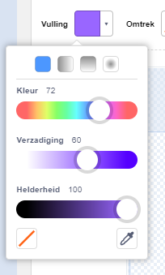
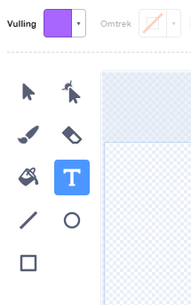
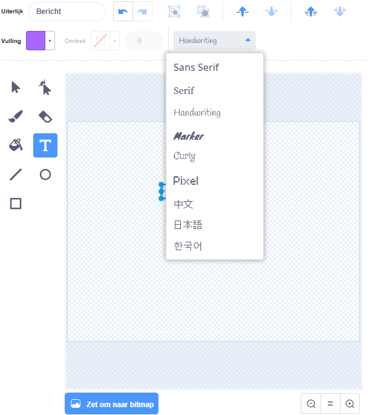
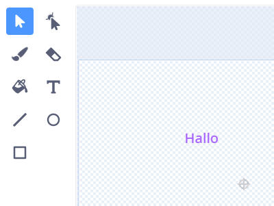
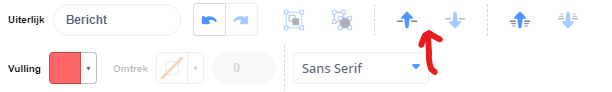

Klik op **Vulling** en selecteer de eerste kleur die je voor jouw tekst wilt gebruiken: {:width="150px"}

Klik op het **Tekst** gereedschap {:width="150px"}

Klik in het werkblad en begin met typen.

Klik in de keuzelijst en selecteer het gewenste lettertype: {:width="300px"}

Klik op de **Selecteren (pijl)** en selecteer je tekst. Versleep de hoekgrepen om het formaat van je tekst te wijzigen: {:width="300px"}

Wil je de **Vulling** kleur wijzigen? Selecteer de **Vulling (emmer)** en plaats de muisaanwijzer op je tekst. De kleur zal automatisch veranderen. Klik op de tekst om de wijziging door te voeren: {:width="150px"}

Als je wilt dat elk woord in je bericht een andere kleur, grootte en lettertype heeft, doe je het bovenstaande voor elk woord in je bericht.

Plaats je tekst en/of een groep woorden met het dradenkruis in het midden van je werkblad: {:width="400px"}

Gebruik de pijlen **Naar voren** en **Naar achteren** om je tekst in verschillende lagen te zetten: {:width="400px"}
