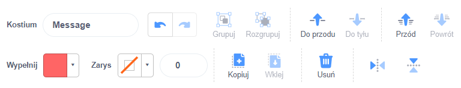

Kliknij **Wypełnij** i wybierz żądany kolor tekstu:

{:width="150px"}

Wybierz narzędzie **Tekst**:

{:width="150px"}

Kliknij na edytor malowania i zacznij pisać.

Kliknij na rozwijanym menu **Czcionka** i wybierz żądaną czcionkę:

{:width="300px"}

Jeśli chcesz zmienić rozmiar tekstu, kliknij narzędzie **Wybierz** (strzałka) i zaznacz tekst, a następnie przeciągnij narożniki, aby zmienić rozmiar tekstu:

{:width="300px"}

Jeśli chcesz zmienić **Wypełnienie** (kolor) w tekście, użyj **Wypełnij** aby wybrać kolor, a następnie wybierz narzędzie **Wypełnij** (Wiaderko) i przytrzymaj kursor myszy nad tekstem (lub jeśli używasz tablet, dotknij tekstu). Tekst automatycznie zmieni kolor. Kliknij tekst, aby dokonać zmiany:

{:width="150px"}

Jeśli chcesz, aby każde słowo w wiadomości miało inny kolor, rozmiar i czcionkę, postępuj zgodnie z powyższą procedurą dla każdego słowa w wiadomości.

Umieść swój tekst i/lub grupę słów za pomocą celownika na środku edytora malowania:

{:width="400px"}

Aby ułożyć słowa warstwowo (nad/pod innymi), użyj narzędzi **Do przodu** i **Do tyłu**:

{:width="400px"}
