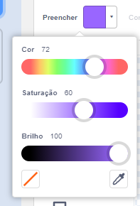
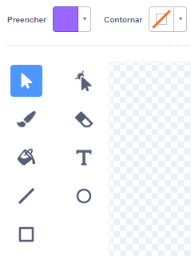
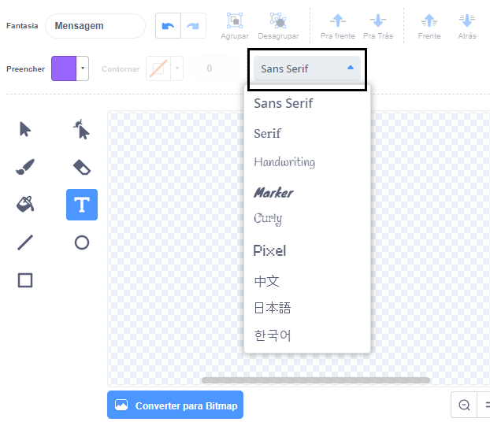
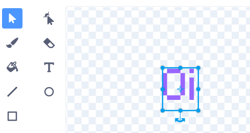
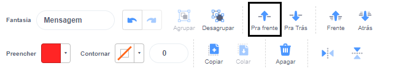

Click no seletor de cor **Preencher** e selecione a cor que você deseja para seu texto:

{:width="150px"}

Selecione a ferramenta **Texto**:

{:width="150px"}

Clique no editor Paint e comece a digitar.

Clique no menu suspenso **Fonte** e selecione a fonte que você deseja:

{:width="300px"}

Se você deseja redimensionar seu texto, clique na ferramenta **Selecionar** (Seta) e selecione o texto, então arraste as alças de canto para redimensionar o texto:

{:width="300px"}

Se você deseja alterar a cor **Preenchimento** do seu texto, use o seletor de cor **Preenchimento** para selecionar a cor, então selecione a ferramenta **Preenchimento** (Balde) e mantenha o cursor do mouse sobre o texto (ou se você estiver usando um tablet, toque no texto). O texto vai mudar de cor automaticamente. Clique no texto para fazer a alteração:

{:width="150px"}

Se você deseja que cada palavra do seu texto tenha uma cor, tamanho e letra diferentes, siga o processo acima para cada palavra de sua mensagem.

Posicione seu texto e/ou grupo de palavras com a cruz no centro do editor do Paint:

{:width="400px"}

Para colocar suas palavras em camadas, use as ferramentas **Pra frente** e **Pra Trás**:

{:width="400px"}

