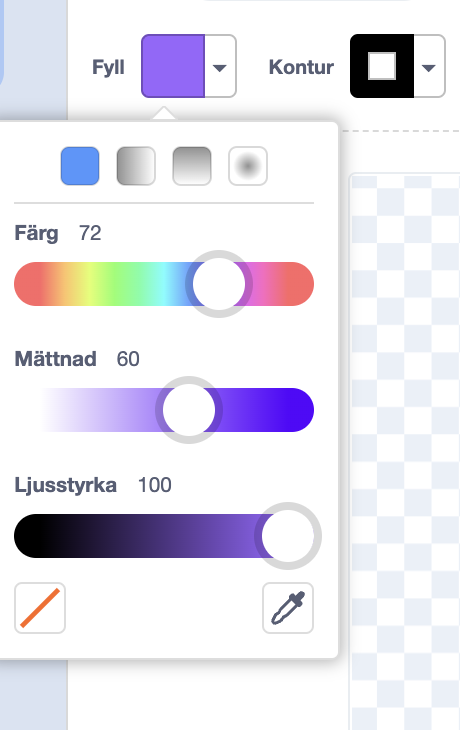
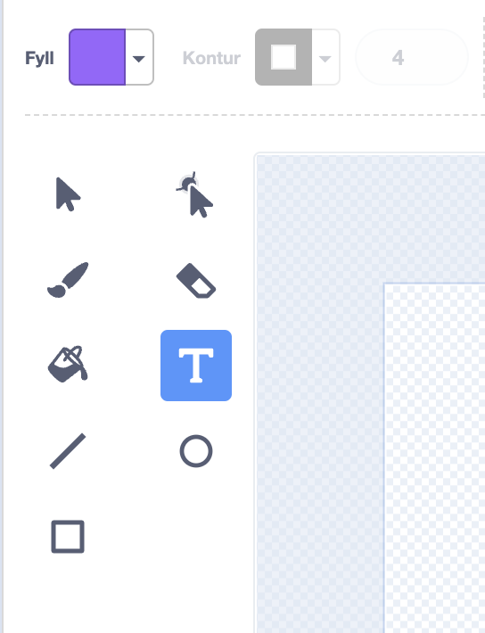
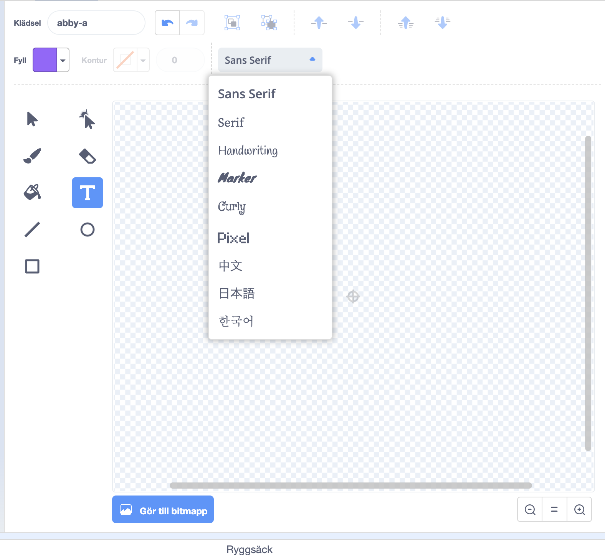
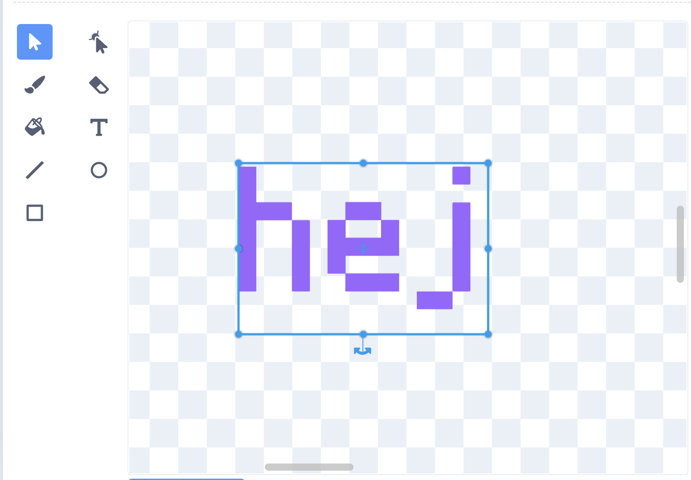
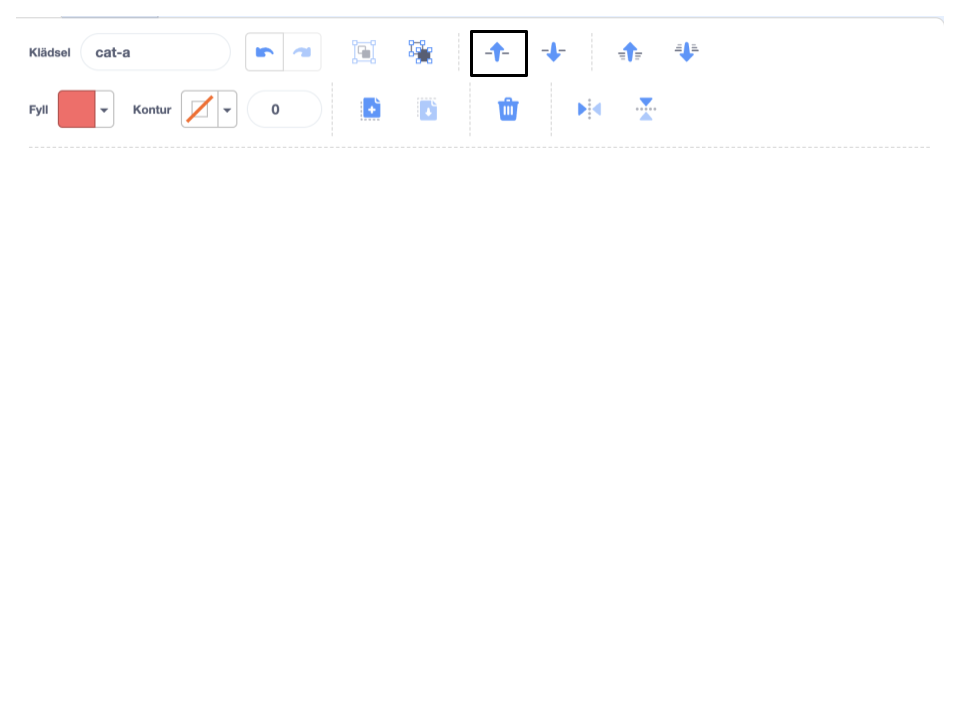

Klicka på **Fyll** färgväljaren och välj den färg du vill ha på din text:

{:width="150px"}

Välj **Text**verktyget:

{:width="150px"}

Klicka på målarredigeraren och börja skriva.

Klicka på rullgardinsmenyn **Teckensnitt** och välj det teckensnitt du vill ha:

{:width="300px"}

Om du vill ändra storlek på din text klickar du på verktyget **Välj** (pil), markerar texten och drar sedan i hörnhandtagen för att ändra storlek på texten:

{:width="300px"}

Om du vill ändra **Fyll**färgen i din text, använd **Fyll**färgväljaren för att välja en färg, välj sedan **Fyll**verktyget (hink) och håll muspekaren över texten (eller om du använder en surfplatta, tryck på texten). Texten kommer automatiskt att ändra färg. Klicka på texten för att göra ändringen:

{:width="150px"}

Om du vill att varje ord i ett meddelande ska ha olika färg, storlek och typsnitt, följ processen ovan för varje ord i ditt meddelande.

Placera din text och/eller grupp av ord med hårkorset i mitten av målarredigeraren:

{:width="400px"}

För att placera orden i olika lager, använd verktygen **Framåt** och **Bakåt**:

{:width="400px"}
