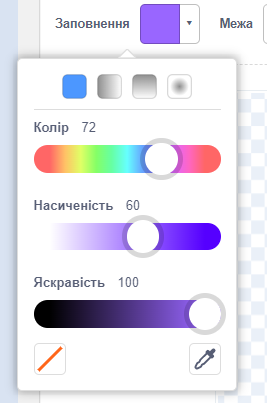
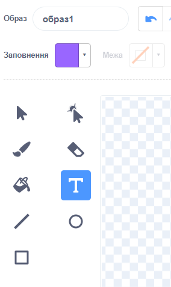
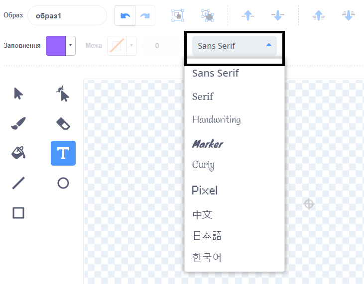
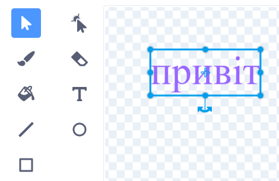
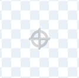
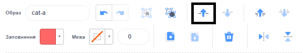

Клацни на інструмент вибору кольору **Заповнення** та вибери потрібний колір для тексту:

{:width="150px"}

Вибери інструмент **Текст**:

{:width="150px"}

Натисни на редактор Малювання та почни набирати текст.

Натисни на спливаюче меню **Шрифт** та обери потрібний тобі шрифт:

{:width="300px"}

Якщо ти хочеш змінити розмір тексту, натисни на інструмент **Обрати** (Стрілка) та вибери текст, а потім перетягни кутові кнопки, щоб змінити розмір тексту:

{:width="300px"}

Якщо ти хочеш змінити колір **Заповнення** твого тексту, використовуй меню вибору кольору **Заповнення** та обери колір, далі вибери інструмент **Заповнення** (Відро) та наведи курсор миші на текст (або, якщо користуєшся планшетом, торкнись тексту). Текст автоматично змінить колір. Натисни на текст, щоб змінити його:

{:width="150px"}

Якщо ти хочеш, щоб кожне слово в повідомленні було іншого кольору, розміру та шрифту, виконай описану вище процедуру для кожного слова у твоєму повідомленні.

Розташуй текст та/або групу слів так, щоб хрестик знаходився в центрі редактора Малювання:

{:width="400px"}

Щоб розкласти слова по шарах, використовуй інструменти **Вперед** та **Назад**:

{:width="400px"}
